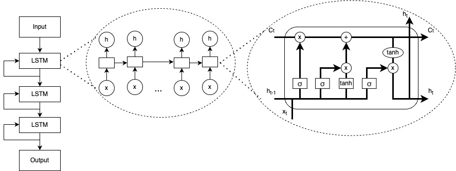

# nDeep for cancer prediction.

This repository contains the code for the paper "**A Study on Survival Analysis Methods Using Neural Network to Prevent Cancers**". ([Cancers](https://www.mdpi.com/2072-6694/15/19/4757))

Brief explanation of model architecture:


This model contains three layers of long short-term memory (LSTM) and one fullyconnected layer that outputs predicted hazard. LSTM is a type of recurrent network (RNN)that has feedback connections that can address vanishing or exploding gradient issues of RNN. Its architecture transforms survival data into sequences of n time steps, which can then be processed and analyzed.

(6) (PDF) A Study on Survival Analysis Methods Using Neural Network to Prevent Cancers. Available from: https://www.researchgate.net/publication/374270245_A_Study_on_Survival_Analysis_Methods_Using_Neural_Network_to_Prevent_Cancers#fullTextFileContent [accessed Oct 06 2023].

## Citation
If you use this model in academic work please feel free to cite our paper.

```
@article{bae2023study,
  title={A Study on Survival Analysis Methods Using Neural Network to Prevent Cancers},
  author={Bae, Chul-Young and Kim, Bo-Seon and Jee, Sun-Ha and Lee, Jong-Hoon and Nguyen, Ngoc-Dung},
  journal={Cancers},
  volume={15},
  number={19},
  pages={4757},
  year={2023},
  publisher={MDPI}
}
```

